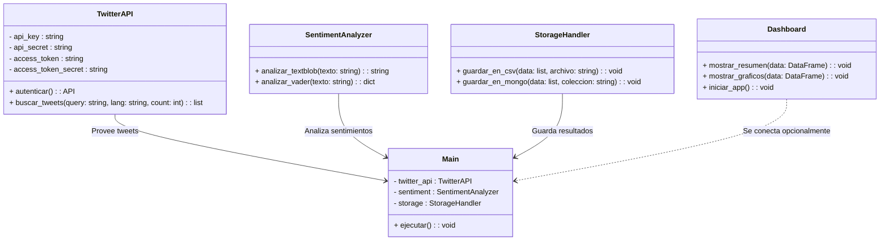

# 🧠 Análisis de Sentimientos sobre los Aranceles de Trump en Twitter

Este proyecto permite recolectar, analizar y visualizar los sentimientos de los usuarios de Twitter sobre los aranceles implementados por Donald Trump. Utiliza Python, procesamiento de lenguaje natural (NLP) y herramientas de visualización para obtener insights políticos y económicos que pueden ayudar a entender cómo se perciben estas políticas en el mundo digital.

---
## 🏗️ Arquitectura de Solución

### 🔹 1. Extracción de Datos
- **Conexión a Twitter**: Utilizamos una herramienta llamada `Tweepy` para conectarnos a la API de Twitter. Esto nos permite acceder a los tweets de usuarios que mencionan temas como:
  - `Trump tariffs` (Aranceles de Trump)
  - `#TrumpTariffs`
  - `China trade war` (Guerra comercial con China)
  - `tariffs support` (apoyo a los aranceles), `tariffs against` (en contra de los aranceles).
- **Recolección de Tweets**: Buscamos tweets públicos que contengan estas palabras clave.
- **Almacenamiento de Datos**: Los tweets obtenidos se almacenan en un sistema de almacenamiento en la nube o de manera local, dependiendo de las preferencias del cliente.

### 🔹 2. Análisis de Sentimientos
- **Procesamiento de Lenguaje Natural (NLP)**: Se utilizan técnicas de procesamiento de texto como `TextBlob` y `VADER` para analizar la polaridad de los tweets.
  - **Positivo**: Tweets que expresan apoyo a los aranceles o posiciones a favor.
  - **Negativo**: Tweets que expresan desacuerdo o críticas hacia los aranceles.
  - **Neutro**: Tweets que no muestran una inclinación clara hacia ninguno de los dos lados.
- **Limpieza de Texto**: El texto se limpia eliminando palabras irrelevantes (como "de", "en", "por") y normalizando las palabras (lematización).

### 🔹 3. Almacenamiento
- **Opciones de Almacenamiento**:
  - **Google Sheets API**: Permite almacenar datos de manera sencilla y accesible desde cualquier lugar. Es útil para compartir resultados rápidamente con equipos pequeños.
  - **MongoDB Atlas Free Tier**: Perfecto para manejar datos no estructurados o semi-estructurados como los tweets. Ofrece escalabilidad, herramientas avanzadas y es ideal para proyectos que planean crecer en volumen de datos.
  - **CSV Local**: La opción más económica y directa, ideal para pruebas rápidas o almacenamiento temporal. Es útil cuando se necesita un formato simple y portátil para analizar datos localmente.

### 🔹 4. Visualización
- **Dashboard Interactivo**: Utilizamos `Streamlit`, una herramienta fácil de usar, para crear un panel donde los usuarios pueden ver:
  - **Tendencias de Sentimiento**: ¿Qué porcentaje de tweets son positivos, negativos o neutros?
  - **Palabras Frecuentes**: Las palabras más comunes que aparecen en los tweets analizados.
  - **Nube de Palabras**: Una representación visual de las palabras más importantes.
  - (Opcional) **Mapa de Calor Geográfico**: Una visualización del sentimiento por ubicación, mostrando cómo se perciben los aranceles en diferentes partes del mundo.

---

## 💰 Presupuesto Estimado

| Recurso                          | Costo mensual | Descripción                                           |
|----------------------------------|---------------|-------------------------------------------------------|
| Twitter API v2 (nivel básico)    | $0            | Gratis hasta 500k tweets por mes                      |
| Render.com / Railway / Heroku    | $0            | Free Tier para scripts Python                         |
| Dominio personalizado (opcional)| $12 anuales   | Para acceso a dashboard vía URL propia                |
| Google Sheets API                | $0            | Gratis                                                |
| MongoDB Atlas Free Tier          | $0            | Hasta 512MB gratis                                    |
| Streamlit Cloud                  | $0            | Hosting para dashboards                               |
| Horas freelance (opcional)       | $200-1000     | Desarrollo o soporte adicional                        |
| Contingencia / Premium APIs      | $500-800      | Modelos ML, upgrades de API, almacenamiento extra     |

**Total estimado:** *hasta 2000 USD con margen para escalar*

---

## 📂 Estructura del Proyecto

trump_tariffs_sentiment/
├── main.py              # Script principal: orquesta la recolección y análisis
├── twitter_api.py       # Módulo para autenticación con la API de Twitter
├── sentiment.py         # Lógica de análisis de sentimientos con TextBlob/VADER
├── storage.py           # Funciones para guardar los datos (CSV, Sheets, Mongo)
├── dashboard.py         # Dashboard interactivo con Streamlit
├── requirements.txt     # Lista de dependencias del proyecto
└── README.md            # Documentación general del proyecto


---

## ✅ Requisitos

- Python 3.8 o superior
- Librerías:
  - `tweepy`
  - `textblob`
  - `nltk`
  - `vaderSentiment`
  - `pandas`
  - `streamlit`
  - `matplotlib`
  - `wordcloud`

---

## 🚀 Ejecución

```bash
pip install -r requirements.txt
python main.py
streamlit run dashboard.py
```
---

## Diagrama de clases


